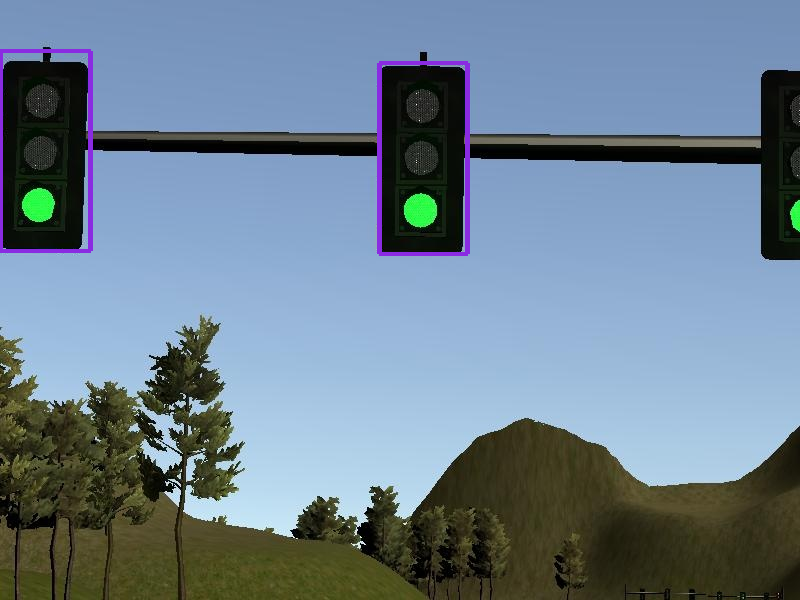
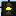

# Udacity Self-Driving Car Engineer Nanodegree

## Capstone Project: Programming a real Self-Driving Car

The final project of Udacity's Self-Driving Car Engineer Nanodegree focuses on system integration. During the course of
the project ROS nodes are implemented, that plan a trajectory along given waypoints, calculate steering commands for the
vehicle and detect traffic lights using a camera mounted behind the windscreen of the vehicle.

Since the project was not completed in a team, the code is only optimized for running in the simulator.

## System Architecture


### Perception

#### Obstacle Detection

_This node was not implemented during this project._

#### Traffic Light Detection Node

The task of this node is to detect traffic lights in the car's camera images and determine their state. Here a two-step
approach was chosen. First the traffic light is detected and cropped, then a classifier is applied to the cropped image
in order to determine the traffic light's state.

##### Traffic Light Detection

For the detection of the traffic lights the Single-Shot-Detector (SSD) _ssd\_mobilenet\_v1\_coco\_11\_06\_2017_ from the
[Tensorflow Detection Model Zoo](https://github.com/tensorflow/models/blob/master/research/object_detection/g3doc/detection_model_zoo.md)
was used. It is trained on the [COCO dataset](http://cocodataset.org/#home), which includes traffic lights
(class ID: 10). From the returned bounding boxes the one with the highest probability is chosen and used to crop the
traffic light from the image.



The cropped image is then passed to the state classifier.

Applying the model to a simulator image takes 90-120ms on the used machine. This means, that the traffic light detection
is too slow to be applied to every image received from the simulator. In order to have the ROS nodes keep up with the
simulator, only every third image is fed to the SSD. This still allows the car to stop at red traffic lights reliably.

##### Traffic light state classifier

Two different approaches were examined for the traffic light state classifier. The first approach tries to identify the
actual lights of the traffic light searching for circles in the image using the Hough transform. Then it applies color
thresholding on the image for red, yellow and green and combines the results. If more than half of the pixels within a
circle are unequal to zero, then the respective light is assumed to be active.


The approach works well on simulator images and has the advantage of taking only very little time to compute (5-7 ms on
my machine). The drawback however is, that the parameters for the Hough transform have to be chosen with regards to the
resolution of the input image. Also this approach will fail, if parts of the traffic light are cropped, i.e. the circles
are not complete. Then the Hough transform will not detect the lights reliably.

For this reason a second approach using a small CNN was implemented. The CNN's input are cropped traffic light images
resized to 16 x 16 pixels.





The architecture of the CNN is based on LeNet, which was used for the traffic sign classification project:

| Layer (type)                   | Output Shape      | Param # |
|--------------------------------|-------------------|---------|
| lambda_1 (Lambda)              | (None, 16, 16, 3) | 0       |
| conv2d_1 (Conv2D)              | (None, 12, 12, 6) | 456     |
| max_pooling2d_1 (MaxPooling2D) | (None, 6, 6, 6)   | 0       |
| dropout_1 (Dropout)            | (None, 6, 6, 6)   | 0       |
| conv2d_2 (Conv2D)              | (None, 2, 2, 6)   | 906     |
| max_pooling2d_2 (MaxPooling2D) | (None, 1, 1, 6)   | 0       |
| dropout_2 (Dropout)            | (None, 1, 1, 6)   | 0       |
| flatten_1 (Flatten)            | (None, 6)         | 0       |
| dense_1 (Dense)                | (None, 120)       | 840     |
| dropout_3 (Dropout)            | (None, 120)       | 0       |
| dense_2 (Dense)                | (None, 84)        | 10164   |
| dropout_4 (Dropout)            | (None, 84)        | 0       |
| dense_3 (Dense)                | (None, 3)         | 255     |

+ Total params: 12,621
+ Trainable params: 12,621
+ Non-trainable params: 0

It was trained on about 580 images extracted from the simulator without pre-training on another dataset. Training for 10
epochs resulted in a validation accuracy of 99.3%.
The time for classifying one image is 10-15ms on the used machine (running Tensorflow *without* GPU support). The model
is also able to classify traffic lights, that are cropped partially.
These advantages made this way of classifying the traffic light state the preferred solution and is used in the final
implementation of the project.

### Planning

The planning subsystem calculates a trajectory for the vehicle based on its current positions and the traffic light
detections provided by the _Traffic Light Detection Node_.

#### Waypoint Loader

The _Waypoint Loader_ node is provided by Udacity and loads waypoints from a csv-file, which are then provided to the
_Waypoint Updater_ node and serve as the basis for the trajectory planning.

#### Waypoint Updater Node

This node is responsible for planning the trajectory based on the waypoints provided by the _Waypoint Loader_ and
detected traffic lights. When there is no traffic light or the traffic light is green, the trajectory is planned along
the base waypoints and the speed is set to the maximum speed, that is configured in _waypoint\_loader.launch_.

Red traffic lights are only taken into account for the planning, if they are closer than 60m. In this case, a
decelerating trajectory is planned as suggested in the walkthrough video. The velocity is calulated by a squre root
function, which takes the distance to the stop line and the maximum deceleration into account.
The vehicle is stopped six waypoints before the stop line. At the fourth traffic light in the simulator the stop line
was so close to the traffic light, that the camera would lose sight of it and thus the car resumed driving, even though
the traffic light was still red. That's why the stop line for this traffic light was moved further away from the traffic
light by adapting the stop line coordinates in _sim\_traffic\_light\_config.yaml_.

### Control

#### Waypoint follower

This node is provided by Udacity. It derives linear and angular velocities from the waypoints published by the
_Waypoint Updater Node_.

#### Drive by Wire (DBW) Node

This node publishes the steering, throttle and braking topics to the vehicle. It has three controllers to derive these
values.

##### Steering control

This controller takes into account the target angular velocity and the current linear velocity and derives the steering
angle from them. The resulting steering angle is then lowpass filtered to avoid jitters in the output signal.

##### Throttle control

This is a PID controller, that sets the throttle value based on the difference between the target velocity and the
current velocity of the vehicle.

##### Braking control

The braking is simply set to 0 at all times, unless the vehicle is supposed to decelerate. Then the braking value is
calculated based on the necessary braking torque to have the vehicle decelerate at the target rate.

## Usage

1. Clone the project repository
```bash
git clone https://github.com/Markus-Heidemann/CarND-Capstone.git
```

2. Install python dependencies
```bash
cd CarND-Capstone
pip install -r requirements.txt
```
3. Make and run styx
```bash
cd ros
catkin_make
source devel/setup.sh
roslaunch launch/styx.launch
```
4. Run the simulator